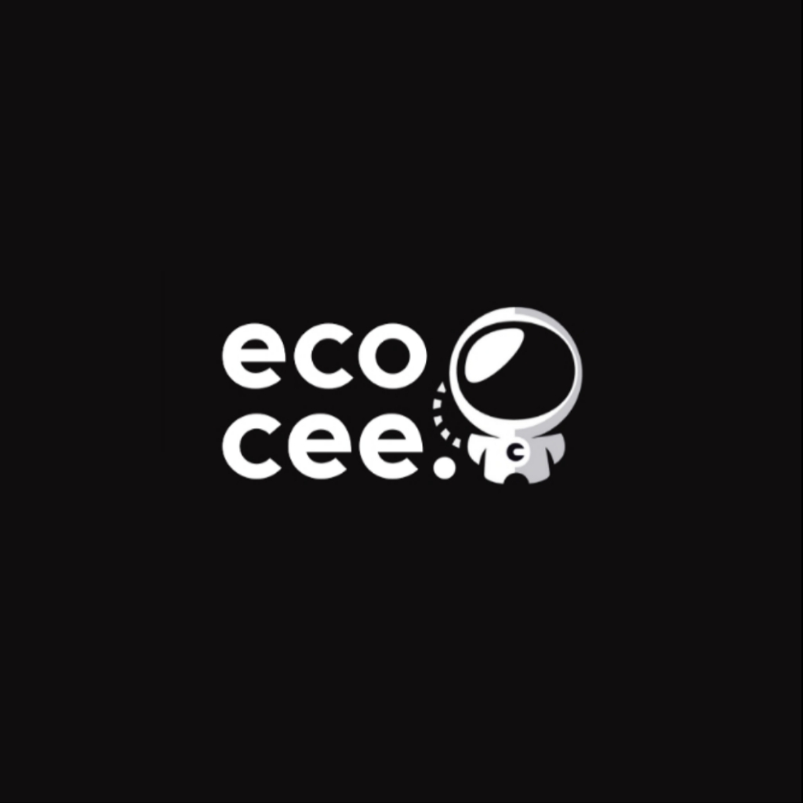

# 🚀 [RoastBot3]

<div align="center">
<div style="background-color: #000; padding: 20px; border-radius: 12px; display: inline-block;">
  
</div>

  
  ### Internship Project at [Ecocee](https://ecocee.in)
  
  [](https://ecocee.in)
  [](mailto:info@ecocee.in)
  
</div>

---

## 📋 Project Overview

**Batch:** [Your Batch - e.g.,  june 2025]  
**Team Number:** [Team #02  
**Internship Position:** [AI/ML Intern]  
**Duration:** [june 13 2025 - june 30 2025]

### 👥 Team Members
| Name | Role | Email | LinkedIn |
|------|------|-------|----------|
| [Sabarinath PS] | [Team Lead] | [psabarinath44@gmail.com] | [https://www.linkedin.com/in/sabarinath-ps-38ab8131a/] |
| [N Amjith Kumar] | [Developer/Researcher] | [amjithkumar999@gmail.com] | [https://www.linkedin.com/in/amjith-kumar-39554a320/] |

> **Note:** Add or remove rows as needed based on your team size

### 🎯 Description
[KTU RoastBot is an AI-powered chatbot that combines humor with intelligence, designed specifically for students of Kerala Technological University (KTU). Unlike typical bots, it roasts users with witty and sarcastic replies before providing helpful answers to academic and general questions. Built using Python, Hugging Face Transformers, and external APIs like DuckDuckGo and Wikipedia, it supports real-time answering without relying on a static dataset. The bot assists with KTU civil engineering topics including formulas, laws, and syllabus details, while also handling fun queries like jokes, movie and music recommendations. Whether accessed via CLI or integrated into a web frontend using React or Streamlit, KTU RoastBot delivers both savage comebacks and genuine support, making it a unique, entertaining, and educational digital assistant for college life.]

---

## 🔧 Technical Specifications

### **For AI/ML Intern Projects:**
- **Programming Languages:** Python, R, Julia, etc.
- **ML Frameworks:** TensorFlow, PyTorch, Scikit-learn, etc.
- **Data Processing:** Pandas, NumPy, OpenCV, etc.
- **Model Type:** [Classification/Regression/NLP/Computer Vision/etc.]
- **Dataset:** [Brief description of data used]

### **For Embedded Developer Intern Projects:**
- **Microcontroller/Platform:** Arduino, Raspberry Pi, ESP32, STM32, etc.
- **Programming Languages:** C/C++, Python, Assembly, etc.
- **Communication Protocols:** I2C, SPI, UART, WiFi, Bluetooth, etc.
- **Sensors/Components:** [List of hardware components used]
- **Development Environment:** Arduino IDE, PlatformIO, Keil, etc.

---

## ⚙️ Project Working

### Architecture Overview
[Provide a high-level overview of how your project works. You can include diagrams, flowcharts, or system architecture images here.]

### Key Components
1. **Component 1:** [Brief description]
2. **Component 2:** [Brief description]
3. **Component 3:** [Brief description]

### Algorithm/Logic Flow
```
Step 1: [Description]
   ↓
Step 2: [Description]
   ↓
Step 3: [Description]
   ↓
Result: [Final output/outcome]
```

---

## 🚀 Applications & Use Cases

### Primary Applications
- **Application 1:** [Academic Q&A Assistant:
Helps KTU students find answers to course-related questions, including civil engineering formulas, laws, module-wise topics, and previous year paper lin]
- **Application 2:** [Humorous Study Companion:
Adds a layer of humor by roasting users before answering — making interaction less robotic and more engaging, especially for bored or procrastinating students.]
- **Application 3:** [General Knowledge & Media Recommender:
Capable of responding to general queries like movie/music suggestions, jokes, and motivational content using a transformer-backed natural language engine.]

### Future Scope
 🔮 Future Scope
Context-Aware Roasting & Memory:
Implement session memory to allow the bot to remember user inputs and deliver more personalized, context-based roast replies or follow-ups.

Multilingual Support for Regional Use:
Add Malayalam and Hindi support to cater to a wider student base within KTU and other regional colleges.

Mobile & App Deployment:
Convert the chatbot into a standalone mobile app using React Native, Flutter, or PWA, allowing students to access it from their phones anytime.

Integration with Student Portals:
Plug the bot into KTU student portals or LMS platforms for real-time academic help, doubt clearing, and notifications with humor.

---

## 📱 Demo & Results

### Screenshots/Images
[
]

### Performance Metrics
 | Metric                  | Value                       |
| ----------------------- | --------------------------- |
| Roast Response Accuracy | \~90% perceived relevance   |
| Factual Answer Match    | \~85% from DuckDuckGo/wikis |
| Processing Time (avg)   | \~1.8 seconds (CPU)         |
| Memory Usage (runtime)  | \~600–800 MB (on i3)        |
| Model Size              | \~345 MB (DialoGPT-small)   |
| Input Tolerance         | Accepts up to 128 tokens    |
| API Dependency Uptime   | 99.9% (duckduckgo-search)   |


## 🛠️ Installation & Setup

### Prerequisites
# Required Software & Libraries
- Python 3.8 or higher
- pip package manager
- Internet connection (for API/model loading)

# Required Python Libraries
- transformers
- torch
- duckduckgo-search
- fastapi
- uvicorn

### Installation Steps
# 1. Clone the repository
git clone https://github.com/your-username/ktu-roastbot.git

# 2. Navigate to project directory
cd ktu-roastbot/backend

# 3. Create virtual environment (optional but recommended)
python -m venv renv
renv\Scripts\activate   # On Windows
source renv/bin/activate  # On macOS/Linux

# 4. Install required packages
pip install -r requirements.txt

### Usage
 # Run the roastbot directly
python roast_engine.py


# Or other execution commands
 # Run backend server
uvicorn app:app --reload


## 📊 Project Structure
ktu-roastbot/
├── backend/                # FastAPI server, roast & answer engines
│   ├── roast_engine.py     # Generates roast replies using DialoGPT
│   ├── answer_engine.py    # Fetches smart answers using web APIs
│   ├── app.py              # FastAPI app entry point
│   ├── train.py            # (Optional) dataset-based training
│   └── requirements.txt    # Backend dependencies
├── frontend/               # Vite + React pixel-style UI
│   ├── src/                # Main React components
│   ├── public/             # Assets like pixel fonts or gifs
│   └── package.json        # Frontend dependencies
├── data/                   # Datasets (if any)
├── models/                 # Stored transformers/tokenizers (local)
├── docs/                   # Documentation or report files
├── tests/                  # Unit tests (optional)
└── README.md               # Project overview


## 🎓 Learning Outcomes
💡 Technical Skills Gained
Fine-tuning and deploying Transformer-based language models

Building FastAPI servers for backend inference

Frontend integration with React (Vite) and REST APIs

Prompt engineering for creative output (roasting)

### Technical Skills Gained
Hugging Face Transformers

PyTorch

FastAPI & Uvicorn

Vite + React

DuckDuckGo Search API

Streamlit (optional web UI)

### Tools & Technologies Mastered
Hugging Face Transformers – for loading and generating responses using pretrained language models like DialoGPT

FastAPI & Uvicorn – to build and serve the backend API for roast and answer functionality

Vite + React – for creating a responsive, retro-style frontend interface

---

## 🤝 Acknowledgments

Special thanks to the **Ecocee team** for providing guidance and support throughout this internship project.

**Mentor:** [Sreeraj V Rajesh]  
**Team Number:** [Team #02]  
**Team Size:** [2]

### 👨‍💼 Team Contributions
| Team Member | Primary Contributions |
|-------------|----------------------|
| [Member 1 Name] | [e.g., Project architecture, ML model development] |
| [Member 2 Name] | [e.g., Data preprocessing, testing] |
| [Member 3 Name] | [e.g., UI/UX design, documentation] |
| [Member 4 Name] | [e.g., Hardware integration, debugging] |

---

## 📞 Contact

**Company:** Ecocee  
**Website:** [ecocee.in](https://ecocee.in)  
**Email:** [info@ecocee.in](mailto:info@ecocee.in)

### 👥 Team Contacts
| Team Member | Email | LinkedIn | GitHub |
|-------------|-------|----------|--------|
| [Member 1 Name] | [email@example.com] | [LinkedIn] | [GitHub Profile] |
| [Member 2 Name] | [email@example.com] | [LinkedIn] | [GitHub Profile] |
| [Member 3 Name] | [email@example.com] | [LinkedIn] | [GitHub Profile] |
| [Member 4 Name] | [email@example.com] | [LinkedIn] | [GitHub Profile] |

---

<div align="center">
  
  **Made with ❤️ during internship at Ecocee**
  
  ⭐ **Star this repo if you found it helpful!** ⭐
  
</div>

---

## 📄 License

This project is developed as part of an internship program at Ecocee. Please refer to the company's guidelines for usage and distribution.

[Optional: Add specific license if applicable]
